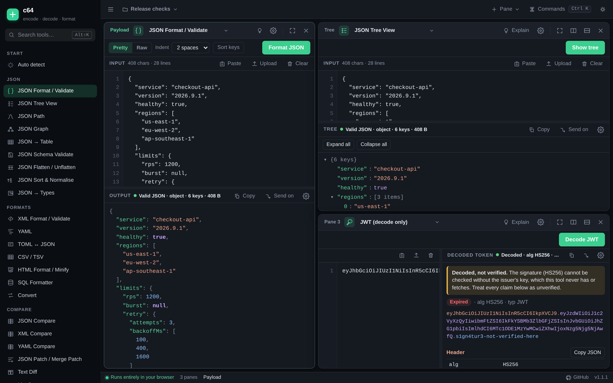
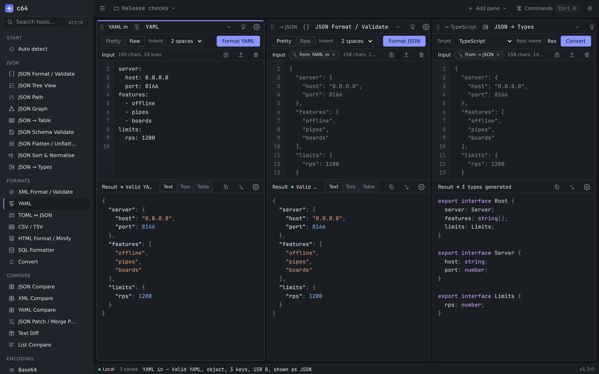
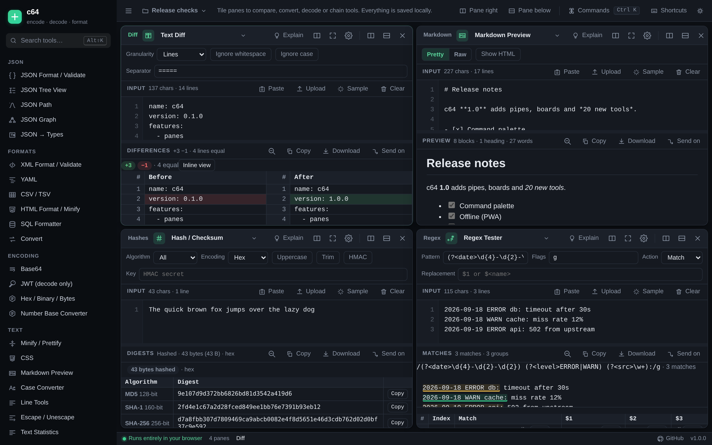

<p align="center">
  
</p>

<h1 align="center">c64</h1>

<p align="center">
  <strong>A local-first workspace for decoding, formatting, converting and inspecting structured text — in tileable panes you can chain together.</strong><br>
  32 tools · zero dependencies · nothing ever leaves your browser.
</p>

<p align="center">
  <a href="https://c64.bjk.ai"></a>
  <a href="https://github.com/adminbjkai/c64/actions/workflows/ci.yml"></a>
  <a href="https://github.com/adminbjkai/c64/releases"></a>
  <a href="LICENSE"></a>
  
</p>

<p align="center">
  
</p>

## Why

Every developer keeps a browser tab open for "format this JSON", "decode this
token", "what's this Base64" — and most of those sites send your payload to a
server. c64 is the opposite: **one page, every tool, all local.** The page
ships a Content-Security-Policy that only allows requests to its own origin,
the server has no POST handler, and your boards live in `localStorage` on
your machine. You can install it as an app and use it offline.

It is also built for real work rather than one-off pastes: tile as many panes
as you need, **pipe** one pane's output into the next (decode → format →
convert → generate types), keep several named **boards**, and drive it all
from a command palette and keyboard shortcuts.

## Tools

| Category | Tools |
|---|---|
| **JSON** | Format / Validate (exact error positions + fix hints, tolerant of trailing commas and smart quotes), Tree View, JSON Path (click-to-path + live queries), Graph (zoomable card tree), JSON → Types (TypeScript, Zod, Python, Go, JSON Schema) |
| **Formats** | XML, YAML, CSV / TSV (table preview, delimiter detection), HTML format / minify, SQL formatter, Convert (JSON ↔ XML ↔ YAML ↔ CSV, any pair) |
| **Encoding** | Base64 (standard / URL-safe, auto-detect), JWT decode (claims explained, expiry badges, never verifies), Hex / Binary / hexdump, Number base converter (BigInt) |
| **Text** | Minify / Prettify (auto-detect), CSS, Markdown preview (sanitised), Case converter (13 styles, all at once), Line tools (sort, dedupe, wrap, number, join, split, …), Escape / Unescape (JSON, JS, CSV, shell, regex, XML, SQL), Text statistics |
| **Web** | URL encode / decode with a full URL breakdown, Query string ↔ JSON, HTML entities, Color converter (hex / rgb / hsl / hwb / named, contrast, tints & shades) |
| **Crypto & IDs** | Hash / HMAC (MD5, SHA-1/256/384/512, CRC32), UUID v4 / v7, ULID, nanoid, passwords — generate or decode |
| **Developer** | Text diff (line / word / char, side-by-side), Regex tester (highlighted matches, named groups, replace, split), Unix time ↔ date (any precision, time zones, relative), Cron expression (plain English + next 10 runs) |

Full option-by-option reference: [docs/modes.md](docs/modes.md).

Every pane also has **Explain** (`Alt+Shift+E`): local heuristics that say what
the input looks like (a JWT, Base64-wrapped JSON, minified XML, CSV, …) and
offer one-click next steps.

## Workspace

<p align="center">
  
</p>

* **Panes** — split right / below, drag seams, maximise one, duplicate, swap,
  rename, close with undo. Each pane remembers its tool, options, Pretty/Raw,
  stacked / side-by-side layout and word wrap.
* **Pipes** — *Send on* opens a new pane that keeps reading this pane's output;
  *Read input from…* links any existing pane. Edit the source and every
  downstream pane updates.
* **Boards** — named boards you can switch, rename, duplicate, export /
  import as JSON, or turn into a share link (the board travels in the URL
  fragment, which never reaches a server).
* **Command palette** (`⌘/Ctrl+K`) — switch tools, run pane actions, jump to
  panes, change boards.
* **Editor** — line-number gutter, tab inserts a tab, drop or upload a file,
  paste from clipboard, one-click sample for every tool.
* **Output** — find with match highlighting, copy, download with the right
  extension, and rich views (tables, trees, swatches, diffs) that stay fast on
  multi-megabyte inputs thanks to a Web Worker.
* **Offline** — installable PWA; the shell is cached after the first visit.
* Light / dark theme, adjustable content size, responsive down to phones.

Shortcut reference: [docs/shortcuts.md](docs/shortcuts.md) (or press `Alt+Shift+/`).

<p align="center">
  
</p>

## Run it yourself

```sh
git clone https://github.com/adminbjkai/c64.git && cd c64
npm install        # dev-only: the TypeScript compiler — nothing at runtime
npm start          # builds, then serves http://127.0.0.1:8166/
```

| Command | What it does |
|---|---|
| `npm run dev` | serve + `tsc --watch` (refresh to see changes) |
| `npm test` | build + unit tests for every library and mode |
| `npm run serve` | production mode: caching, compression, security headers |
| `node scripts/gen-docs.mjs` | regenerate `docs/modes.md` and `docs/shortcuts.md` |
| `npm run screenshots` | re-capture the README screenshots (Playwright) |

`HOST` / `PORT` override the bind address; `GET /healthz` returns
`{"ok":true,"version":"…"}`. Deploying behind nginx with systemd is described
in [docs/deployment.md](docs/deployment.md); the exact files used for
c64.bjk.ai are in [`deploy/`](deploy/).

## Privacy, concretely

| Guarantee | How it is enforced |
|---|---|
| No request carries your content | CSP `default-src 'self'; connect-src 'self'` in the page **and** as a response header; the server only serves its own files |
| Nothing is stored server-side | There is no POST handler; boards are in your browser's `localStorage` |
| Share links are private | The board is compressed into the URL `#fragment`, which browsers never send |
| JWTs are only decoded | The tool has no keys and fetches none; the "not verified" notice is permanent |
| Offline cache holds no data | The service worker caches the app shell only |

## Design notes

* **Zero runtime dependencies, no bundler.** Plain `tsc` emits ES modules the
  browser loads directly. The YAML, XML, HTML, SQL, CSS, CSV, Markdown and
  JSONPath parsers are hand-rolled subsets; each file's header states its exact
  scope (for example YAML has no anchors/aliases/tags, XML has no DTD entity
  expansion). That is a deliberate trade for a build you can read end to end.
* **Modes are pure functions** `(input, ctx) → result`, so they run unchanged in
  the Web Worker (used above 150 000 characters) and are unit-tested without
  a browser. Rich output is a serialisable view descriptor rendered by a
  separate module.
* **Shortcuts use `Alt+Shift+key`** because `Ctrl/Cmd+Shift` collides with text
  selection in the editor and with browser tab shortcuts.
* More in [docs/architecture.md](docs/architecture.md).

## Contributing

Bug reports and pull requests are welcome — see [CONTRIBUTING.md](CONTRIBUTING.md)
and [docs/adding-a-mode.md](docs/adding-a-mode.md). The whole test suite runs in
under a second, so adding a tool is a pleasant afternoon.

## License

[MIT](LICENSE) © 2026 Murry (bjk.ai)
